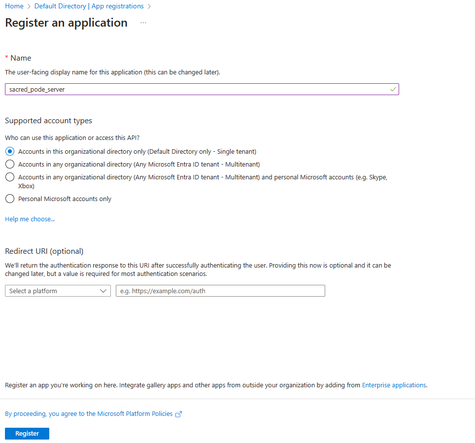
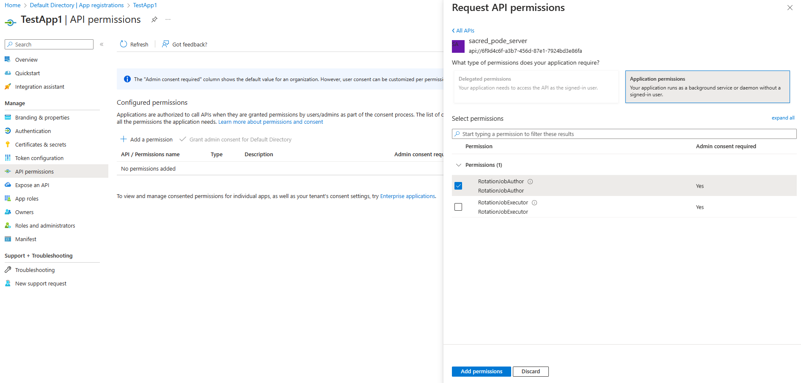
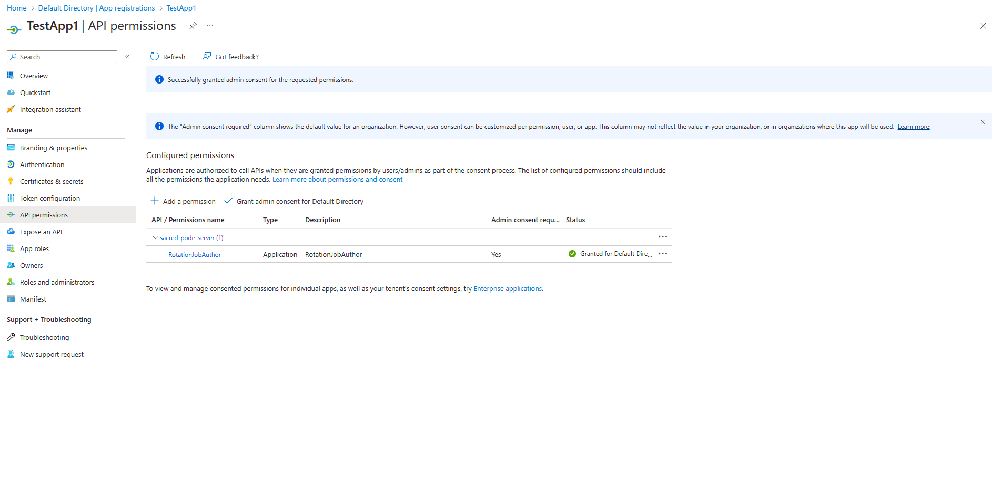

<div align="center">
    <p>
        <a align="center" href="" target="_blank">
            
        </a>
    </p>

[](https://www.powershellgallery.com/packages/SACRED.Server.Pode)
[](https://opensource.org/license/mit/)
</div>

## The SACRED Pode Server

SACRED comes with a fully functioning [Pode server](https://badgerati.github.io/Pode/) setup to allow the product to scale, be remotely accessed and centrally managed. It also provides a scheduling implementation to enable rotation jobs to be executed at different frequencies.

### Installation

First follow the existing guide to install the core SACRED modules, which include the SACRED Pode server. Ensure the Pode Powershell modules have already been [installed](https://badgerati.github.io/Pode/Getting-Started/Installation/) as well.

Next, create a server [configuration file](https://badgerati.github.io/Pode/Tutorials/Configuration/) named `server.psd1` that will provide Pode (as well as SACRED) with the information it needs to run. The following is a template that can be used:

```powershell
@{
    #This field specifies the address the server should listen to requests on (e.g. localhost). It is required.
    Address = 'localhost'

    #This field specifies the port the server should listen to requests on (e.g. 8080). It is required.
    Port = 8080

    #This field specifies the protocol the server should listen to requests with (either Http or Https). It is required.
    Protocol = 'Http'

    #Uncomment the following section if the Https protocol is to be used with an auto generated self-signed certificate.
    <#
    #This field indicates the Https protocol is to be used with an auto generated self-signed certificate.
    SelfSigned = $true
    #>

    #Uncomment the following section if the Https protocol is to be used with a pfx certificate that's stored in a file.
    <#
    #This field specifies the path to the pfx certificate file.
    Certificate = ''

    #This field specifies the password for the pfx certificate.
    CertificatePassword = ''
    #>

    #Uncomment the following section if the Https protocol is to be used with a certificate that's stored in the Windows certificate store.
    <#
    #This field specifies the thumbprint of the certificate to use.
    CertificateThumbprint = ''

    #This field specifies the Windows certificate store name to use e.g. My.
    CertificateStoreName = ''

    #This field specifies the Windows certificate store location to use e.g. CurrentUser.
    CertificateStoreLocation = ''
    #>

    Server = @{
        Request = @{
            #This field specifies the request timeout in seconds. Increase this value if rotation jobs are taking longer than 5 minutes to complete.
            Timeout = 300
        }
    }

    SACRED = @{
        #This field specifies the SACRED store implementation to use. It is required.
        StoreType = 'Local'

        #If the StoreType is Local then this field specifies the base path where the files are stored. If the StoreType is Local then it is required.
        LocalStoreBasePath = ''

        #This field specifies the SACRED logger implementation to use (recommended to be the Pode version). It is required.
        LoggerType = 'Pode'

        #If the LoggerType is Pode then this field specifies the base path where the log files are stored. If the LoggerType is Pode then it is required.
        PodeLoggerBasePath = ''

        #If the LoggerType is Pode then this field specifies the maximum number of days to retain the log files. If the LoggerType is Pode then it is required.
        PodeLoggerMaxDaysRetention = 7

        #This field specifies the SACRED secret store implementation to use (either PodeConfigFile or EnvironmentVariable). It is required.
        SecretStoreType = 'PodeConfigFile'

        #This field specifies the authentication mechanism to use when validating access to the REST APIs (one of ApiKey, EntraServicePrincipalJWT, or None). It is required.
        ApiAuthenticationType = 'ApiKey'

        #Uncomment the following section if the ApiKey authentication type will be used to validate access to the REST APIs.
        <#
        #This field specifies the name of the secret (within the SACRED secret store) that contains the first version of the API key needed to access APIs that author rotation job definitions.
        RotationJobAuthorApiKey1SecretName = ''

         #This field specifies the name of the secret (within the SACRED secret store) that contains the second version of the API key needed to access APIs that author rotation job definitions.
        RotationJobAuthorApiKey2SecretName = ''

         #This field specifies the name of the secret (within the SACRED secret store) that contains the first version of the API key needed to access APIs that execute rotation job definitions.
        RotationJobExecutorApiKey1SecretName = ''

        #This field specifies the name of the secret (within the SACRED secret store) that contains the second version of the API key needed to access APIs that execute rotation job definitions.
        RotationJobExecutorApiKey2SecretName = ''
        #>

        #Uncomment the following section if the EntraServicePrincipalJWT authentication type will be used to validate access to the REST APIs.
        <#
        #This field specifies the client ID of the App Registration object that represents this application, within Entra (formerly Azure Active Directory).
        ClientId = ''
        #>

        #Uncomment the following section if SACRED will need to connect to Azure to carry out rotation functionality, using an interactive prompt to login.
        <#
        #This field specifies whether SACRED will need to connect to Azure to carry out rotation functionality.
        ConnectToAzure = $true

        #This field specifies the Azure tenant ID to connect to.
        AzureTenantId = ''
        #>

        #Uncomment the following section if SACRED will need to connect to Azure to carry out rotation functionality, connecting using a managed identity.
        <#
        #This field specifies whether SACRED will need to connect to Azure to carry out rotation functionality.
        ConnectToAzure = $true

        #This field specifies the Azure tenant ID to connect to.
        UseAzureManagedIdentity = $true
        #>

        #Uncomment the following section if SACRED will need to connect to Azure to carry out rotation functionality, connecting using a service principal client ID and secret.
        <#
        #This field specifies whether SACRED will need to connect to Azure to carry out rotation functionality.
        ConnectToAzure = $true

        #This field specifies the Azure tenant ID to connect to.
        AzureTenantId = ''

        #This field specifies the Azure service principal's client ID to use for the connection.
        AzureServicePrincipalClientId = ''

        #This field specifies the Azure service principal's secret to use for the connection.
        AzureServicePrincipalClientSecret = ''
        #>

        #Uncomment the following section if SACRED will need to connect to Azure to carry out rotation functionality, connecting using a service principal client ID and certificate.
        <#
        #This field specifies whether SACRED will need to connect to Azure to carry out rotation functionality.
        ConnectToAzure = $true

        #This field specifies the Azure tenant ID to connect to.
        AzureTenantId = ''

        #This field specifies the Azure service principal's client ID to use for the connection.
        AzureServicePrincipalClientId = ''

        #This field specifies the Azure service principal's certificate thumbprint to use for the connection.
        AzureServicePrincipalClientCertificateThumbprint = ''
        #>

        #The following specifies the different SACRED schedules that exist and how frequent they should execute (in cron format). Add, remove or modify as required.
        Schedules = @(
            @{
                Name = 'weekly'
                CronSchedule = '0 12 * * SAT'
            },
            @{
                Name = 'daily'
                CronSchedule = '0 1 * * *'
            },
            @{
                Name = 'hourly'
                CronSchedule = '0 * * * *'
            }
        )
    }

    Service = @{ }
    Web = @{ }
    Smtp = @{ }
    Tcp = @{ }
}
```

### Starting and stopping

To start the SACRED Pode server execute `Start-SACREDPodeServer`, ensuring the `server.psd1` configuration file is present in the directory from where the command is run.

> [!NOTE]
> The number of threads the server uses can be modified via the `ServerThreads` parameter during startup. By default this is set to 3 but to change this to say, 10 threads, then the server should be started by executing `Start-SACREDPodeServer -ServerThreads 10`.

The SACRED Pode server can be terminated by sending a `Ctrl+C` signal to the running process.

The SACRED Pode server can be restarted by sending a `Ctrl+R` signal to the running process.

### Usage

There are a number of RESTful APIs exposed by the server, which ultimately reflect SACRED's operations. The following details what those APIs are, and how to access them.

#### Authentication and authorisation

The APIs make use of Role Based Access Control (RBAC) to control their execution. There are two roles a user can have, which in turn decides which APIs can and cannot be called by them (detailed below); those roles are `RotationJobAuthor` and `RotationJobExecutor`.

The current authentication mechanisms supported by the SACRED Pode server are by API key, or by using an Entra (formerly Azure Active Directory) issued JWT token for a service principal.

> [!NOTE]
> Authentication and authorisation can be disabled altogether by setting the `SACRED.ApiAuthenticationType` field to `None` within the `server.psd1` configuration file (or omitting the field completely).

##### API Key

To use an API key to authenticate to the SACRED Pode server APIs, perform the following steps:

1. Within the `server.psd1` configuration file set the `SACRED.ApiAuthenticationType` field to `ApiKey`.
1. Still within the `server.psd1` configuration file, ensure the following fields are populated:
    - `SACRED.RotationJobAuthorApiKey1SecretName` - This field specifies the name of the secret (within the SACRED secret store) that contains the first version of the API key needed to access APIs that author rotation job definitions.
    - `SACRED.RotationJobAuthorApiKey2SecretName` - This field specifies the name of the secret (within the SACRED secret store) that contains the second version of the API key needed to access APIs that author rotation job definitions.
    - `SACRED.RotationJobExecutorApiKey1SecretName` - This field specifies the name of the secret (within the SACRED secret store) that contains the first version of the API key needed to access APIs that execute rotation job definitions.
    - `SACRED.RotationJobExecutorApiKey2SecretName` - This field specifies the name of the secret (within the SACRED secret store) that contains the second version of the API key needed to access APIs that execute rotation job definitions.
1. Populate the four actual API key values against their respective secret name within the SACRED secret store implementation being used. The keys can be in whatever format is desired.
1. When making a call to one of the APIs ensure the `X-API-KEY` HTTP header is populated with a valid API key value, depending on whether the API requires the `RotationJobAuthor` or `RotationJobExecutor` role.

##### Entra Service Principal JWT

To use an Entra service principal's JWT token to authenticate to the SACRED Pode server APIs, perform the following steps:

1. Within the Entra tenant, create a new App Registration that will represent the SACRED Pode server (the name can be whatever is desired):

    

1. Assign the new App Registration an Application ID URI, which should be of the form `api://<APP REGISTRATION'S CLIENT ID>`:

    

1. Create two new App Roles within the App Registration (`RotationJobAuthor` and `RotationJobExecutor`) that grant access to applications only:

    

1. Within the `server.psd1` configuration file set the `SACRED.ApiAuthenticationType` field to `EntraServicePrincipalJWT`.
1. Still within the `server.psd1` configuration file, ensure the following fields are populated:
    - `SACRED.ClientId` - This field specifies the client ID of the App Registration just created, within Entra (formerly Azure Active Directory).
1. For any service principal that wishes to call the APIs, ensure it gets assigned (and granted) at least one of the `RotationJobAuthor` or `RotationJobExecutor` roles on the SACRED Pode server's App Registration:

    
    

    > [!NOTE]
    > The above shows how to assign the permissions if the service principal is associated with another Entra App Registration. If this is not the case and the service principal is standalone (perhaps as part of a Managed Identity) then the Azure Portal cannot currently assign the permissions; therefore a scripting language such as Powershell will need to be used instead. More information on how to do this can be found [here](https://learn.microsoft.com/en-us/entra/identity/managed-identities-azure-resources/how-to-assign-app-role-managed-identity-powershell).

1. Before the service principal calls an API it will need to request Entra to generate it a signed JWT token. There are numerous libraries that exist to help with this; one way of doing this with Powershell would be:
    - Log in to Azure as the service principal by using the `Connect-AzAccount` cmdlet (either with a [secret](https://learn.microsoft.com/en-us/powershell/module/az.accounts/connect-azaccount?view=azps-10.4.1#example-3-connect-to-azure-using-a-service-principal-account), a [certificate](https://learn.microsoft.com/en-us/powershell/module/az.accounts/connect-azaccount?view=azps-10.4.1#example-7-connect-using-certificates), or a [managed identity](https://learn.microsoft.com/en-us/powershell/module/az.accounts/connect-azaccount?view=azps-10.4.1#example-5-connect-using-a-managed-service-identity)).
    - Execute the `(Get-AzAccessToken -ResourceUrl 'PUT SACRED PODE SERVER APP REGISTRATION CLIENT ID HERE').Token` command to retrieve the Base64 encoded JWT token.
1. When making a call to one of the APIs ensure the `Authorization` HTTP header is populated with `Bearer PUT BASE64 ENCODED JWT TOKEN HERE`.

#### API reference

<details>
<summary><code>POST</code> <code><b>/api/rotationjob</b></code> <code>(registers a rotation job definition)</code></summary>

##### RBAC Role

> RotationJobAuthor

##### Parameters

> None

##### Responses

> | Http Code     | Content-Type                      | Response                                                            |
> |---------------|-----------------------------------|---------------------------------------------------------------------|
> | `201`         | `application/json`        | `Rotation job definition created successfully.`                      |
> | `500`         | `application/json`        | `The error message, in JSON format.` |

##### Example cURL

> ```javascript
>  curl -X POST -H "Content-Type: application/json" --data 'put rotation job definition json here' http://localhost:8080/api/rotationjob
> ```

</details>

<details>
<summary><code>POST</code> <code><b>/api/rotationjob/{rotation_job_name}</b></code> <code>(registers a rotation job definition with a specific name)</code></summary>

##### RBAC Role

> RotationJobAuthor

##### Parameters

> | Name      |  Type     | Data Type               | Description                                                           |
> |-----------|-----------|-------------------------|-----------------------------------------------------------------------|
> | `rotation_job_name`      | required  | string  | The name of the rotation job definition to register.  |

##### Responses

> | Http Code     | Content-Type                      | Response                                                            |
> |---------------|-----------------------------------|---------------------------------------------------------------------|
> | `201`         | `application/json`        | `Rotation job definition created successfully.`                      |
> | `500`         | `application/json`        | `The error message, in JSON format.` |

##### Example cURL

> ```javascript
>  curl -X POST -H "Content-Type: application/json" --data 'put rotation job definition json here' http://localhost:8080/api/rotationjob/randomname
> ```

</details>

<details>
<summary><code>DELETE</code> <code><b>/api/rotationjob/{rotation_job_name}</b></code> <code>(deletes a specific rotation job definition)</code></summary>

##### RBAC Role

> RotationJobAuthor

##### Parameters

> | Name      |  Type     | Data Type               | Description                                                           |
> |-----------|-----------|-------------------------|-----------------------------------------------------------------------|
> | `rotation_job_name`      | required  | string  | The name of the rotation job definition to delete.  |

##### Responses

> | Http Code     | Content-Type                      | Response                                                            |
> |---------------|-----------------------------------|---------------------------------------------------------------------|
> | `204`         | `application/json`        | `Rotation job definition successfully deleted.`                      |
> | `500`         | `application/json`        | `The error message, in JSON format.` |

##### Example cURL

> ```javascript
>  curl -X DELETE http://localhost:8080/api/rotationjob/randomname
> ```

</details>

<details>
<summary><code>POST</code> <code><b>/api/rotationjob/{rotation_job_name}/run</b></code> <code>(executes a rotation job definition with a specific name)</code></summary>

##### RBAC Role

> RotationJobExecutor

##### Parameters

> | Name      |  Type     | Data Type               | Description                                                           |
> |-----------|-----------|-------------------------|-----------------------------------------------------------------------|
> | `rotation_job_name`      | required  | string  | The name of the rotation job definition to execute.  |

##### Responses

> | Http Code     | Content-Type                      | Response                                                            |
> |---------------|-----------------------------------|---------------------------------------------------------------------|
> | `200`         | `application/json`        | `Rotation job definition executed successfully.`                      |
> | `500`         | `application/json`        | `The error message, in JSON format.` |

##### Example cURL

> ```javascript
>  curl -X POST http://localhost:8080/api/rotationjob/randomname/run
> ```

</details>

<details>
<summary><code>POST</code> <code><b>/api/schedule/{schedule_name}/run</b></code> <code>(executes a rotation job schedule with a specific name)</code></summary>

##### RBAC Role

> RotationJobExecutor

##### Parameters

> | Name      |  Type     | Data Type               | Description                                                           |
> |-----------|-----------|-------------------------|-----------------------------------------------------------------------|
> | `schedule_name`      | required  | string  | The name of the rotation job schedule to execute.  |

##### Responses

> | Http Code     | Content-Type                      | Response                                                            |
> |---------------|-----------------------------------|---------------------------------------------------------------------|
> | `200`         | `application/json`        | `Rotation job schedule executed successfully.`                      |
> | `500`         | `application/json`        | `The error message, in JSON format. There may be multiple errors contained within the message.` |

##### Example cURL

> ```javascript
>  curl -X POST http://localhost:8080/api/schedule/randomname/run
> ```

</details>